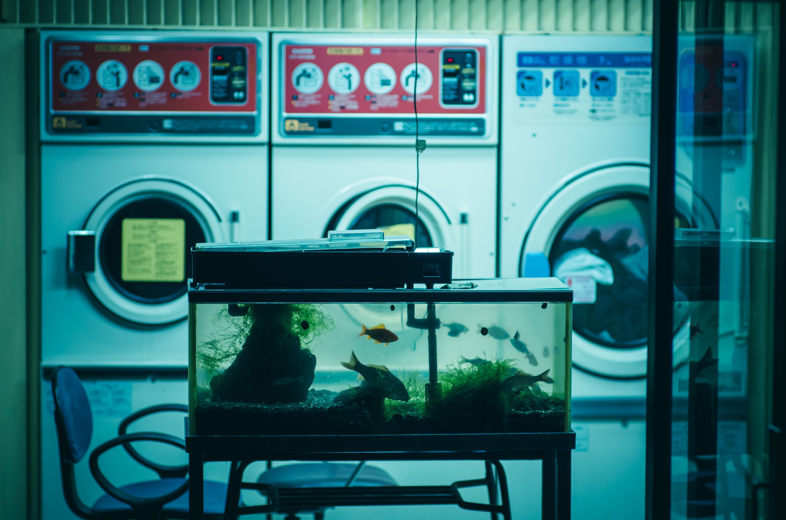
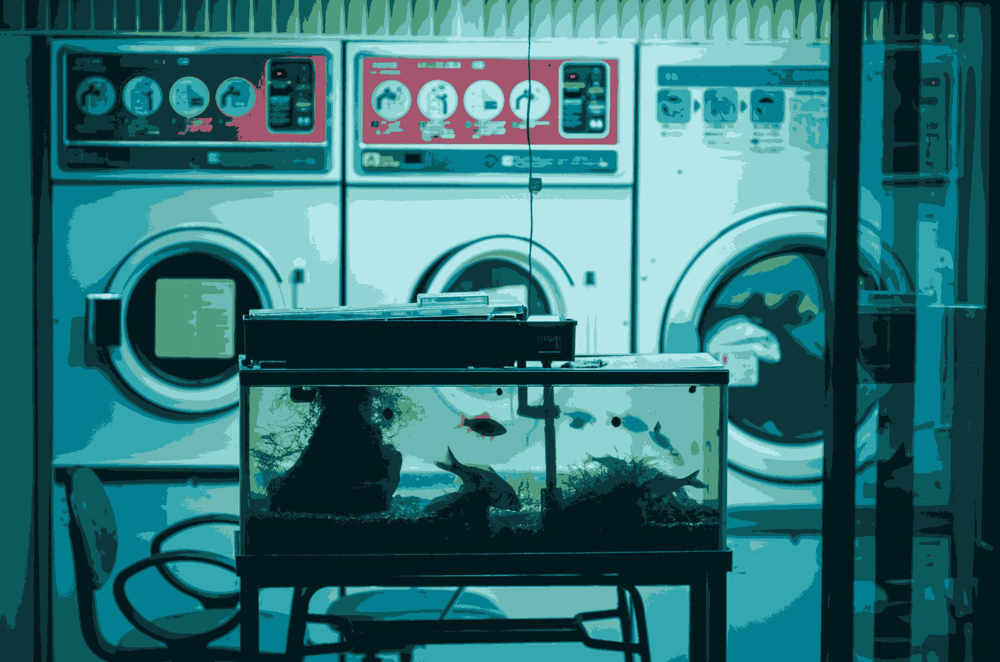
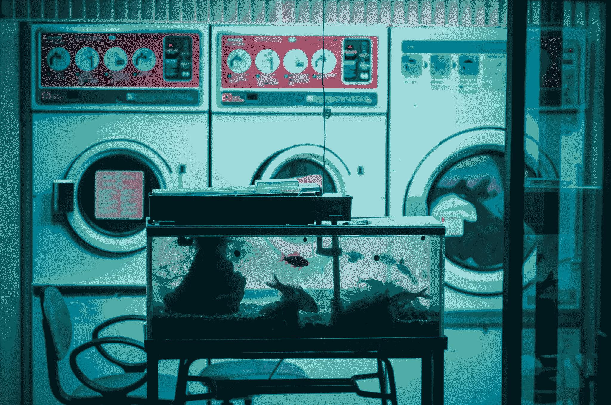
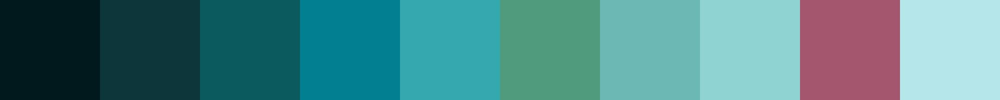

# Go Quantise
## Overview
Library to quantise images using algorithms from `Virmajoki, O., & Franti, P. (2003). Multilevel thresholding by fast PNN-based algorithm. Image Processing: Algorithms and Systems II. doi:10.1117/12.477741`

## Install
```
go get github.com/fiwippi/go-quantise/pkg/quantisers
go mod tidy
```

## Usage
Errors ignored for brevity
```go
// Read in an image
reader, _ := os.Open("fish.jpg")
img, _, _ := image.Decode(reader)

// Quantise the image with PNN
colours := pnn.QuantiseColour(img, 10)
quantisedImg, _ := quantisers.ImageFromPalette(img, colours, quantisers.NoDither)
paletteImg := quantisers.ColourPaletteImage(colours, 200)

// Save the recreated image
savedImg, _ := os.Create("fish-quantised.jpg")
png.Encode(savedImg, quantisedImg)

// Save the colour palette image
savedImg, _ = os.Create("fish-palette.jpg")
png.Encode(savedImg, paletteImg)
```

## Result 
### Input

### Output
#### Raw

#### Dithered (Floyd-Steinberg)

#### Palette


### Notes
The quantisation algorithms implemented from the paper are:
- FastOtsu
- Lloyd Max Quantiser (LMQ)
- PNN (In RGB and LAB space)

Available dithering algorithms are:
- Floyd-Steinberg
- Floyd-Steinberg Serpentine
- Bayer 2x2 Matrix
- Bayer 4x4 Matrix
- Bayer 8x8 Matrix

Due to limitations of each algorithm:
- Otsu only supports greyscale quantisation with `m = 1`
- LMQ only supports greyscale quantisation
- Images with `m = 1` do not dither.

Sections of this code are adapted from Miller Chan's code found [here](`https://github.com/mcychan/nQuantCpp). 
A big thank you to him for his help in explaining sections of it.

## License
`MIT`