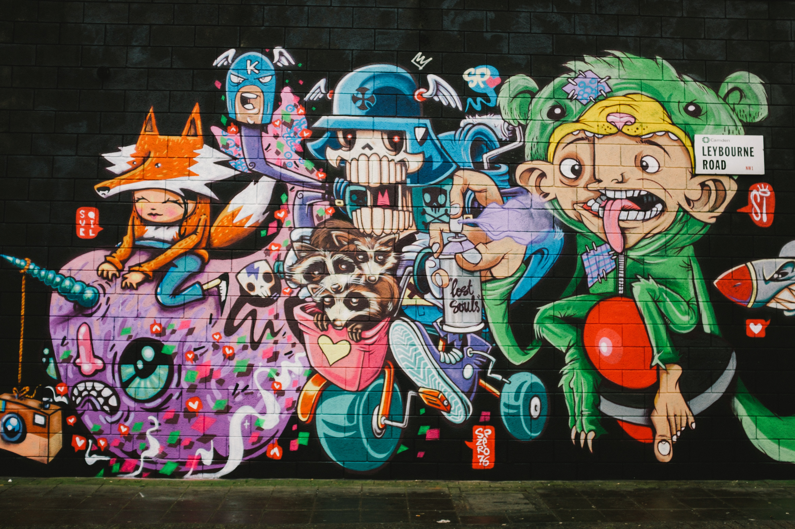
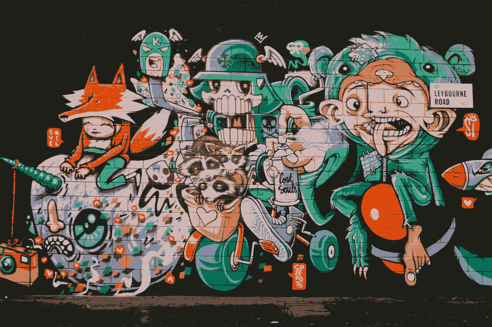
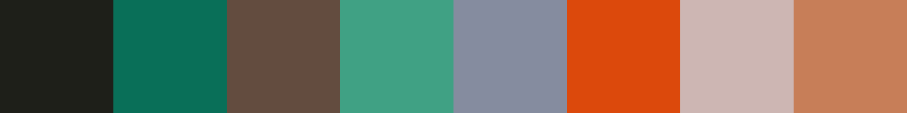

## Dominant Colour
This package quantises images into colour palettes and can recreate quantised images from these palettes. You can find the *n* most dominant colours in an image.

### Algorithms Implemented
As described in:`Virmajoki, O., & Franti, P. (2003). Multilevel thresholding by fast PNN-based algorithm. Image Processing: Algorithms and Systems II. doi:10.1117/12.477741`
- [x] 1\. "FastOTSU"
- [x] 2\. "Lloyd Max Quantiser"
- [x] 3\. "PNN"

As described in: `Need to find an octree paper`
- [ ] 4\. "Octree"

### Notes
Due to limitatios of each algorithm:
- Otsu only supports greyscale quantisation with `m = 1`
- LMQ only supports greyscale quantisation with any `m` value

### Example
```go
// Read in an image
reader, err := os.Open("graffiti.jpg")
if err != nil {
    log.Fatal(err)
}
defer reader.Close()

img, _, err := image.Decode(reader)
if err != nil {
    log.Fatal(err)
}

// Creating the PNN Quantiser
PNN := quantisers.NewPNNQuantiser()

// Quantise the image into 5 colours
colours, err = PNN.Colour(img, 5)
if err != nil {
    log.Fatal(err)
}

// Recreate the image from the quantised pallet
quantisedImg, err = quantisers.ImageFromPalette(img, colours)
if err != nil {
    log.Fatal(err)
}

// Create an image of the colour palette
palette = quantisers.ColourPalette(colours, 200)

// Save the recreated image
savedImg, err := os.Create("graffiti-recreated.png")
if err != nil {
    log.Fatal(err)
}
defer savedImg.Close()

if err = png.Encode(savedImg, quantisedImg); err != nil {
    log.Fatal(err)
}

// Save the colour palette image
savedImg, err = os.Create("graffiti-pallet.png")
if err != nil {
    log.Fatal(err)
}
defer savedImg.Close()

if err = png.Encode(savedImg, palette); err != nil {
    log.Fatal(err)
}
```

### Result
#### Input

#### Output



*Image sourced from Daniel Clay via Unsplash*

### TODO
- [x] finish pnn
- [x] clean up api
- [x] change description of repo
- [ ] weighted colour values 
- [ ] benchmarking
- [ ] add octree method
- [ ] use lab colourspace