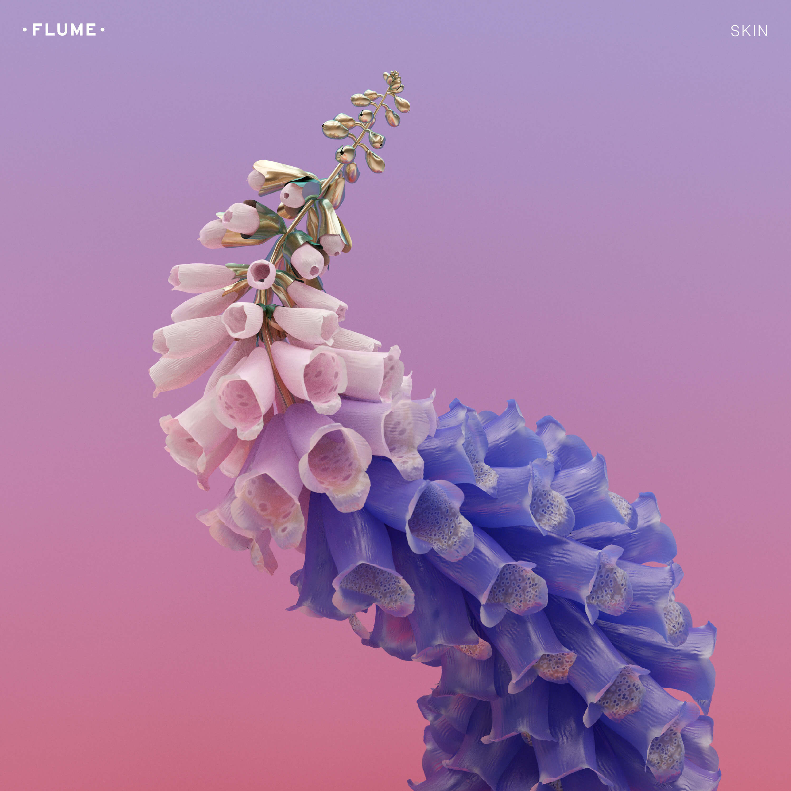
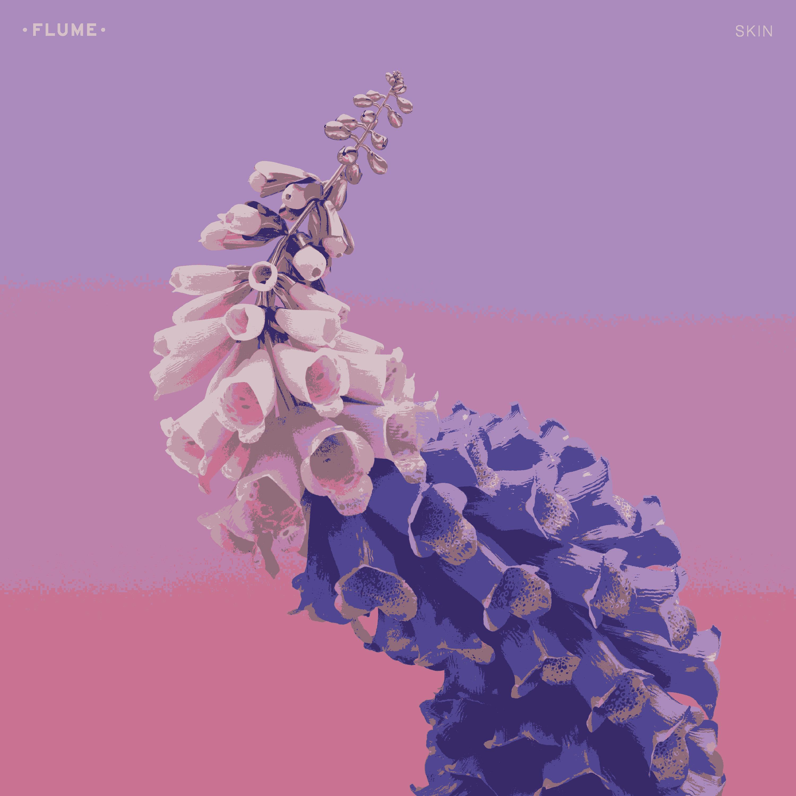

## Dominant Colour

### Algorithms Implemented
- [x] 1\. "Basic" [Colour Quantization in Images](https://pdfs.semanticscholar.org/fc50/a3950d6ce54717b945079329069dcd8ccb7a.pdf)
- [ ] 2\. "FastOTSU"
- [ ] 3\. "PNN"

### Description
Finds *n* most dominant colours in an image

###### TODO
- [x] Stop too many colours causes program exit
- [ ] Fix memory leak for the first algorithm

### Important!!!
The `FindDominantColoursBT()` method is quite slow for large images and contains memory leaks, please bear this in mind until they are resolved

### Example Code
#### Supplying Path
```go
package main

import dc "github.com/nadav-rahimi/dominant-colour"

func main() {
    // Get the 6 most dominant colours from the image
    colours := dc.FindDominantColoursBT("path/to/image.jpg", 6)
    // Draw a rectangle of these colours
    dc.DrawRectangle(colours)
    // Recreate the image using these colours
    dc.RecreateImage("path/to/image.jpg", colours)
}
```

#### Supplying Pixel Set
```go
package main

import dc "github.com/nadav-rahimi/dominant-colour"

func main() {
    // Get the pixel set
    pixels := dc.Img2pixelset("path/to/image.jpg")
    // Get the 6 most dominant colours from the image set
    colours := dc.FindDominantColoursBTFromSet(pixels, 6)
    // Draw a rectangle of these colours
    dc.DrawRectangle(colours)
    // Recreate the image using these colours
    dc.RecreateImage("path/to/image.jpg", colours)
}
```

### Example Results
#### Input


#### Output (8 Colours)


#### Dominant Colours Rectangle

